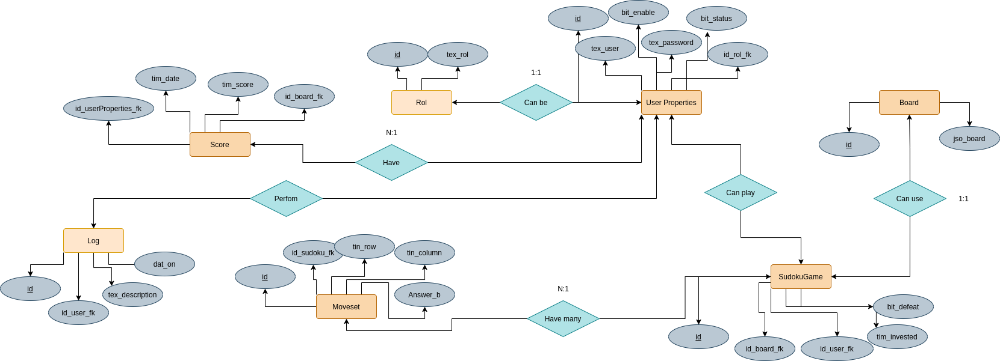
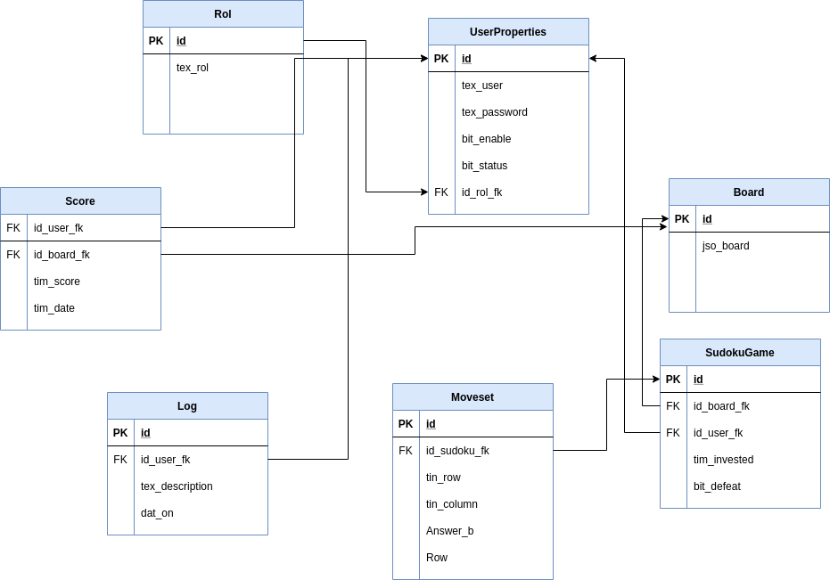

Documentacion
===

Lluvia de ideas Para la base de datos
---

A continuación se describen las entidades desarrolladas para la estructura de la base de datos, cada creación y cada modificación a una entidad particular es descrita en orden. Se describen tambien a su debido tiempo procedimientos almacenados y demas objetos que existen en la definición de la base de datos.

La primera entidad que se define es la Entidad **UserProperties**, que contiene: 
- id: SERIAL PRIMARY KEY - identificador único para el usuario.
- tex_user: TEXT NOT NULL - nombre de usuario.
- tex_password: TEXT NOT NULL - contraseña de usuario.
- tex_rol: ENUM("admin", "player") - rol del usuario dentro del sistema, solo puede haber un administrador que crea a los demás usuarios.

Se crea un procedimiento almacenado **sp_validate(IN V_USER TEXT, IN V_PASSWORD TEXT, OUT ROL INT)**, el cual validará si el usuario y/o contraseña existen o coinciden, retornando el rol como resultado.

Se crea una funcion **fn_searchUser(V_USER TEXT) RETURNS INT**, Esta función buscará un usuario en la base de datos, será usada para evitar que ingresen usuarios iguales.

Se crean entidades diferentes para cada tablero:

>
>CREATE TABLE debug(a INT, b INT, c INT, d INT, e INT, f INT, g INT, h INT, i INT);

>CREATE TABLE n00b(a INT, b INT, c INT, d INT, e INT, f INT, g INT, h INT, i INT);

>CREATE TABLE l33t(a INT, b INT, c INT, d INT, e INT, f INT, g INT, h INT, i INT);

>CREATE TABLE error(a INT, b INT, c INT, d INT, e INT, f INT, g INT, h INT, i INT);
>
- Se insertan los tableros fila por fila

Se modifican las entidades para cada tablero a la entidad **Board**, que Contiene:
- id: SERIAL PRIMARY KEY - identificador único para el tablero.
- tex_name: VARCHAR(50) NOT NULL - nombre del tablero.
- jso_board: JSON - contenedor tipo objeto para la matriz que representa el tablero.

Se crea la entidad **Movimientos**, que Contiene:
- id: SERIAL PRIMARY KEY - identificador único para el movimiento.
- tin_fila: TINYINT NOT NULL - número que almacena la fila del movimiento.
- tin_col: TINYINT NOT NULL - número que almacena la columna del movimiento.
- tin_answer: TINYINT NOT NULL - número que almacena la respuesta en esa casilla.

Se crea la entidad que almacenará la informacion de los juegos de Sudoku, con nombre **SudokuGame**, que contiene:
- id: SERIAL PRIMARY KEY - identificador único para el juego.
- id_board_fk: BIGINT UNSIGNED NOT NULL - llave foránea que referencia una relación 1:1 (Cada juego de Sudoku esta relacionado con un único tablero).
- id_user_fk: BIGINT UNSIGNED NOT NULL - llave foránea que referencia una relación 1:N (Cada juego tiene un único usuario, un usuario puede tener varios juegos). 
- tim_inverted: TIME - Tiempo invertido en el juego (valor DEFAULT '00:00:00').
- bit_on_hold: BIT - dato sobre el estado del juego, si esta en espera o terminado (valor DEFAULT 1).
- bit_defeated: BIT - dato sobre la terminacion de un juego como derrota (valor DEFAULT 0).

Se crea una entidad **Rol**, 'Role' es una palabra reservada en SQL por lo que se usará 'Rol' en su lugar, que contiene:
- id: SERIAL PRIMARY KEY - identificador único para el Rol.
- tex_rol: TEXT NOT NULL - nombre del rol, la definicion solo muestra la existencia de dos roles, admin y player.

Se modifica la entidad **UserProperties**, se cambia de nombre a **UserInformation** y se agregan dos atributos atributos:
- id: SERIAL PRIMARY KEY - identificador único para el usuario.
- id_rol_fk: BIGINT UNSIGNED NOT NULL - llave foránea que referencia una relación 1:N (Cada Usuario tiene un único rol, un rol puede tener varios usuarios). 
- tex_user:TEXT NOT NULL - nombre de usuario.
- tex_password:TEXT NOT NULL - contraseña de usuario.
- bit_status: BIT NOT NULL - dato para representar el estado activo o inactivo de un juego en progreso (valor DEFAULT 0).

Se modifica el procedimieno **sp_validate(IN V_USER TEXT, IN V_PASSWORD TEXT, OUT ID_USER BIGINT UNSIGNED, OUT ROL_USER BIGINT UNSIGNED, OUT STATUS_USER BIT)**: Este procedimiento validará si el usuario y/o contraseña existen o coinciden y almacenará el id, rol y status.

Se modifica la entidad **SudokuGame**, descartando el atributo bit_on_hold ya que este atributo se ha transferido a la entidad UserProperties, se modifica el nombre del atributo tim_inverted a tim_invested, la entidad **SudokuGame** actualizada contiene:
- id: SERIAL PRIMARY KEY - identificador único para el juego.
- id_board_fk: BIGINT UNSIGNED NOT NULL - llave foránea que referencia una relación 1:1 (Cada juego de Sudoku esta relacionado con un único tablero).
- id_user_fk: BIGINT UNSIGNED NOT NULL - llave foránea que referencia una relación 1:N (Cada juego tiene un único usuario, un usuario puede tener varios juegos). 
- tim_invested: TIME - Tiempo invertido en el juego (valor DEFAULT '00:00:00').
- bit_defeated: BIT - dato sobre la terminacion de un juego como derrota (valor DEFAULT 0).

Se modifica la entidad **Movimientos**, pasa a llevar el nombre **Moveset**. Se añade la funcionalidad de encriptación a esta tabla para encriptar las respuestas, para evitar el uso de trampas. Y se agregan atributos. La entidad actualizada Contiene:
- id: SERIAL PRIMARY KEY - identificador único para el movimiento.
- id_sudokuGame_fk: BIGINT UNSIGNED NOT NULL - llave foránea que referencia una relación 1:N con SudokuGame (Cada juego de Sudoku puede tener muchos movimientos). 
- tin_fila: TINYINT NOT NULL - número que almacena la fila del movimiento.
- tin_col: TINYINT NOT NULL - número que almacena la columna del movimiento.
- tin_answer: TINYINT NOT NULL - número que almacena la respuesta en esa casilla.
- Answer_b: VARBINARY(20) - Campo que almacenará las respuestas encriptadas.

Se crea una entidad **Scores**, que almacenara información sobre los puntajes obtenidos en los juegos. Sus atributos son descritos acontinuación.
- id: SERIAL PRIMARY KEY - identificador único para cada puntaje.
- id_userInformation_fk: BIGINT UNSIGNED NOT NULL - llave foránea que hace referencia a una relación 1:N con UserInformacion (Cada usuario puede tener muchos puntajes).
- id_board_fk: BIGINT UNSIGNED NOT NULL - Llave foránea que apunta al tablero en el cual se terminó el juego. (Relación 1:1)
- tim_score: TIME NOT NULL - Tiempo de juego en el tablero.
- tim_date: TIMESTAMP - Fecha y hora en la cual se obtuvo el score (valor DEFAULT NOW()).

Se crea un procedimiento almacenado **sp_deleteScore(IN IDUSER INT)**, Este procedimiento eliminará los puntajes que no estén en la lista de los mejores 10 para evitar que la base de datos se llene de datos que no serán utilizados.

Se crea una función **fn_selectBoard(ID_USER TEXT) RETURNS BIGINT UNSIGNED**, Esta función retornará el id del board del último juego de un jugador.

Se crea una función **fn_jsonBoard(jso_board JSON) RETURNS TEXT** para extraer una matriz, arreglo bidimensional que representa el trablero, del atributo JSON del registro recibiendo el atributo JSON como parámetro.

Se modifica la entidad **Board**, la entidad actualizada pasa a incluir el nombre del tablero en el atributo de tipo JSON, la entidad actualizada contiene:
- id: SERIAL PRIMARY KEY - identificador único para el tablero.
- jso_board: JSON - contenedor tipo objeto que contiene el nombre del tablero como valor para la llave 'name', y la matriz que representa el tablero como valor para la llave 'board'.

Se crea una función **fn_boardName(jso_board JSON) RETURNS TEXT** para extraer el nombre de un tablero del atributo JSON del registro recibiendo el atributo JSON como parámetro.

Se modifica la entidad **Moveset**, para que solo contenga la respuesta encriptada en sus atributos, descartando la respuesta sin encriptar.
- id: SERIAL PRIMARY KEY - identificador único para el movimiento.
- id_sudokuGame_fk: BIGINT UNSIGNED NOT NULL - llave foránea que referencia una relación 1:N con SudokuGame (Cada juego de Sudoku puede tener muchos movimientos). 
- tin_fila: TINYINT NOT NULL - número que almacena la fila del movimiento.
- tin_col: TINYINT NOT NULL - número que almacena la columna del movimiento.
- Answer_b: VARBINARY(20) - atributo que almacenará las respuestas encriptadas.

Se crea una entidad para la Bitácora, con nombre **Log**, que servirá como bitácora para el sistema, incluyendo a todos los usuarios del sistema, se almacenarán varias acciones. Contiene como atributos:
- id: SERIAL PRIMARY KEY - idenntificador único para cada registro.
- id_user_fk: BIGINT UNSIGNED NOT NULL - llave foránea que referencia una relacion 1:N (Cada usuario tiene varias acciones en la bitácora).
- tex_description VARCHAR(500) NOT NULL - Descripción de la acción que esta entrada contiene.
- dat_on: DATETIME NOT NULL - Fecha en la cual se registra esta entrada (valor DEFAULT CURRENT_TIMESTAMP).

Se modifica la entidad **UserInformation** y se agregan un atributo para deshabilitar usuarios cuando estos se eliminan, para preservar la informacion en el sistema:
- id: SERIAL PRIMARY KEY - identificador único para el usuario.
- id_rol_fk: BIGINT UNSIGNED NOT NULL - llave foránea que referencia una relación 1:N (Cada Usuario tiene un único rol, un rol puede tener varios usuarios). 
- tex_user:TEXT NOT NULL - nombre de usuario.
- tex_password:TEXT NOT NULL - contraseña de usuario.
- bit_status: BIT NOT NULL - dato para representar el estado activo o inactivo de un juego en progreso (valor DEFAULT 0).
- bit_enable: BIT NOT NULL - dato para representar el estado activo o inactivo de un usuario.

Se crea el procedimiento llamado **sp_pushMove(IN id_game INT, tiny_row TINYINT, tiny_column TINYINT, answer INT)** que inserta los movimientos del usuario en la tabla Moveset. Este procedimiento, además, encripta la variable answer con un AES_ENCRYPT, para posteriormente, ser insertado en el campo Answer_b VARBINARY(20).

Se crea la función **fn_decrypt_answer(answer VARBINARY(20)) RETURNS TEXT** que desencriptará las respuestas almacenadas en el campo Answer_b de la tabla Moveset. Esta función se usará cuando se quiera reanudar un juego en curso.

Se crea un vista **vw_allScores** para tomar los valores que se presentaran en la ventana de Puntajes desde una consulta menos extensa.

Creación de los Triggers: 
- Trigger1: **CREATE TRIGGER tg_insertUser** este será el encargado de agregar a la bitácora cuando el usuario administrador ingrese un nuevo usuario a la base de datos.

- Trigger2: **CREATE TRIGGER tg_updateUser** este será el encargado de agregar a la bitácora cuando el usuario administrador actualice un usuario a la base de datos.

- Trigger3: **CREATE TRIGGER tg_deleteUser** este será el encargado de agregar a la bitácora cuando el usuario administrador elimine usuario a la base de datos.

- Trigger4: **CREATE TRIGGER tg_stop** este será el encargado de enviar a la bitácora una señal cuando el usuario haya detenido o pausado el juego. 

En la versión final se obtuvieron los resultados que se demuestran en cada diagrama.

Diagrama ER
===

Diagrama Relacional
===

Creación del archivo ini
===
Se genera una sección llamada dbinfo, que tiene toda la información necesaria para la conexión a la base de datos como lo es:  
- host
- port 
- user 
- password 
- database 

Creación de archivo ConfigConection
===
- Se crea una clase llamada ConfigConnection
- En esta clase está toda la información que se necesitará para poder conectar el archivo ini con la información de la base de datos 

Archivo main.py 
===
- Se importan los archivos SplashScreen y Login
- Se crea instancia del SplashScreen 
- Se crea instancia del Login

Archivo SplashScreen
===
- Este archivo es el que mostrará la imagen de bienvenido al juego, se realizó toda la información de la ventana usando tkinter 

Archivo Login
===
- Se importa: 
    - tkinter: Tk, Label, Entry, Button, StringVar
    - functools: partial
    - mysql.connector 
    - Archivo Menu
- Se crea ventana de Login, pidiendo entrada del usuario, contraseña y se incluye un botón
- Se establece la conexión a la base de datos
- Se realiza la transacción de los mismos 
- Se guardan los datos necesarios 
- Se cierra la conexión 

Archivo Menu
===
- Se importa: 
    - tkinter: Tk, Label, Button, messagebox
    - functools: partial
    - mysql.connector 
    - Archivo ManagerUser
    - Archivo LevelSelection
    - Archivo ScoreTable 
    - Archivo Sudoku
- Se crean botones : 
    - Administrar usuarios
    - Iniciar nuevo juego 
    - Reanudar juego 
    - Scores 
- Administración de usuarios: 
    - Función manage: 
        - Se destruye la ventana actual 
        - Se accede al portal CRUD (de sus siglas en ingles Create/Update/Delete)
- Inicio del juego: 
    - Función play: 
        - Generar la conexión a la base de datos
        - Creación de cursor para transacción de SQL
        - Si el usuario tiene un juego en progreso debe pedirse confirmacion para eliminarlo
        - Cerrar la conexión a la base de datos 
        - Se destruye la ventana actual 
        - Se accede a la selección de los niveles 
- Reanudando el juego: 
    - Función resume: 
        - Se crea una ventana
        - Se genera la conexión a la base de datos 
        - Se crea el cursro a la base de datos 
        - Se ejecuta la consulta para tomar el id del board que se quiere reanudar
        - Se crea un objeto con el nombre del tablero
        - Se rellena el tablero --> game.start()
        - Se dibuja la ventana del juego
        - Se destruye la ventana actual
- Scores(Viasualizacion de Puntajes): 
    - Función score: 
        - Se destruye la ventana actual
        - Se accede a la tabla de scores con el idUser del usuario

Archivo ManagerUser: 
===
- Se importa: 
    - tkinter: Tk, Label, Entry, Button, Listbox, StringVar, ttk, CENTER, END
    - functools: partial
    - mysql.connector
- Este archivo se encargará de administrar los usuarios creados por el admin
- Permite crear usuarios, actualizar usuarios y eliminar usuarios
- Se recuperan los registros para mostrarlos en la tabla 
- Función searchUser: 
    - Se realiza la transacción de la búsqueda de la información del usuario 
    - Se muestran los registros en la tabla
- Función createUser: 
    - Se verifican los campos que no estén vacíos 
    - Se crea una transacción que llamará a una función, esta devolverá: 0 si no existe, 1 si existe
    - Si el usuario ya existe dirá que ya existe
    - Si no existe ingresará a una función o procedimiento almacenado
    - Se limpian las entradas de texto y los mensajes 
- Función updateUser: 
    - Se verifica si los campos no están vacíos 
    - Se crea una transacción que llamará a una función, esta devolverá: 0 si no existe, 1 si existe
    - Si el usuario ya existe dirá que ya existe
    - Si no existe ingresará a una función o procedimiento almacenado
    - Se actualizan los registros
    - Se limpian las entradas de texto y los mensajes
- Función deleteUser: 
    - Se verifica si los campos no están vacíos 
    - Se crea una transacción que llamará a una función, esta devolverá: 0 si no existe, 1 si existe
    - Si el usuario ya existe dirá que ya existe
    - Si no existe ingresará a una función o procedimiento almacenado
    - Se actualizan los registros
    - Se limpian las entradas de texto y los mensajes
- Función updateTable: 
    - Se limpian los registros de la tabla para que no se duplique la información
    - Se realiza la transacción 
    - Se muestran los registros en la tabla
- Función selectColumn:
    - Esta función mostrará todos los valores actualizados
- Función connection: 
    - Generará toda la conexión a la base de datos

Archivo LevelSelection.py
===
- Se importa: 
    - tkinter: TK, Label, OptionMenu, StringVar
    - Archivo Sudoku
    - mysql.connector
- Se crea la ventana donde se desplegará la lista de los tableros 
- Función select: 
    - Se crea la ventana
    - Se genera la conexión a la base de datos 
    - Se crea un objeto con el nombre del tablero como parámetro
    - Se dibuja la ventana del jurgo 
    - Se destruye la ventana actual 
    - Se muestra la ventana 

Archivo ScoreTable.py
===
- Se crea la ventana 
- Se genera la conexión a la base de datos
- Se envía la información de los scores para ser mostrados
- Se guardan los resultados de la transacción 
- Se crea la tabla en donde serán mostrados los datos con los siguientes encabezados: 
    - Posición 
    - Tiempo
    - Tablero 
    - Fecha

- Archivo Sudoku.py 
=== 
-  Se importa:  
    - tkinter: Tk, Canvas, Frame, Lable, Button, BOTH, LEFT, RIGHT, TOP, BOTTOM, StringVar, messagebox
    - time: time, strftime
    - time
    - mysql.connector
    - sys
    - io 
    - json
**Este es el archivo del juego, y muchas de las funciones fueron especificadas en la definición del proyecto, por tanto sólo se describirán las que fueron agregadas por los desarolladores**
- Función para insertar registros de juego: 
    - Función __insertGameRecord: 
        - se establece la conexión a la base de datos
        - Se crea el cursor para la transacción a la base de datos 
        - Si el juego se esta reanudando se debe tomar el id del juego y asignarlo a self.idGame
        - De lo contrario se debe insertar un nuevo registro y se toma el id del registro recien insertado
        - Se inserta un nuevo registro para almacenar datos de cada juego
        - Se obtiene el id del juego recién insertado y lo almacenamos 
        - Se actualiza el estado del jugador con respecto a su juego actual en progreso
        - Se cierra la conexión a la base de datos 
- Función __initUI:  
    - Se generan los botones: 
        - Pausar
        - Terminar
        - Regresar a la selección de niveles
        - Regresar movimiento: El botón de limpiar los movimientos regresará al último movimiento realizado por el jugador
- Función __recover_puzzle: 
    - Se genera la conexión a la base de datos
    - Se crea el cursor para la transacción de los datos a SQL 
    - se carga el conjunto de movimientos hechos en el juego, a la vez que se desencriptan los valores.
    - Se posiciona cada respuesta almacenada en su respectivo lugar
    - Se cierra la conexión a la base de datos 
- Función __draw_time: 
    - Se crea una variable temporal que obtiene el tiempo de inicio del juego
    - Se crea una variable que servirá como interruptor, mientras esté en  el tiempo seguirá en marcha
- Función __get_time: 
    - Se crea una variable que obtiene el tiempo actual del juego
    - La variable comenzará con el tiempo en 0 segundos (puesto que el total de la diferencia del tiempo de inicio del juego con el tiempo actual del juego es cero cuando ambos tiempos tienen aproximadamente el mismo valor, caso que sucede al inicio del juego)
    - El tiempo será asignado en formato HH:MM:SS
    - Se actualiza el tiempo
    - Si la variable que sirve como interruptor esta "encendida" Se añade un proceso para llamar a la misma funcion __get_time dentro de 10 ms.
- Función __draw_victory: 
    - Se crea el óvalo con la frase "You win!" indicando que se termina el juego
    - Se genera la conexión a la base de datos
    - Se crea el cursor 
    - Se crea una transacción de la selección de datos
    - Se ejecuta la consulta para actualizar el tiempo del juego
    - Se actualiza el estado del jugador para que ya no tenga opcion de reanudar juegos (meduante ek bit_status)
    - Se cierra la conexión a la base de datos 
- Función __key_pressed: 
    - Se apila el movimiento realizado
- Función __push_move: 
    - Esta función apilará un movimiento en la pila de movimientos del juego hechos por el jugador
    - Se genera la conexión a la base de datos 
    - Se crea el cursor de python
    - Al momento del llamado de esta función, el self contiene la fila y la columna  en la que se quiere ingresar los datos, a la vez que se encripta la respuesta ingresada.
    - Se cierra la conexión de la base de datos
- Función __pop_move: 
    - Esta función desapila un movimiento realizado por el jugador 
    - Se genera la conexión a la base de datos 
    - Se crea el cursor 
    - Se crea una transacción para recuperar el último movimiento hecho por el jugador 
    - Se elimina el último movimiento de la tabla y del tablero
    - Se cierra la base de datos 
    - Se dibuja el puzzle actualizado
- Función __pause_game: 
    - Función para pausar el juego
    - Se debe obtener o reanudar el tiempo del cronómetro
    -  Se debe de cambiar la etiqueta del botón que ahora se lea "Reanudar"
    - Se bloquea el ingreso para más respuestas
- Función __finish_game: 
    - Función para terminar el juego 
    - Se genera la conexión a la base de datos
    - Se debe desplegar un mensaje que pida la confirmación del usuario 
    - Se crea el cursor 
    - Se ejecuta una consulta para actualizar el tiempo del juego y el bit_defeated
    - Se desplegará un nuevo mensaje ofreciendo iniciar un juego nuevo en el mismo tablero
    - Si no se acepta iniciar en el mismo tablero se desplega un mensaje para iniciar nuevo juego en un tablero diferente
    - Se cierra la conexión a la base de datos 
    - 
- Clase SudokuBoard: 
    - Función __create_board: 
        - Se crea la conexión a la base de datos 
        - Se crea el cursor 
        - Se ejecuta la transacción de datos (consulta de mostrar el tablero que se ha seleccionado)
        - Se carga el arreglo bidimensional
        - Se cierra la base de datos 

Hallazgos
===

Para poder cargar los tableros de una forma eficiente, JSON era la mejor opción, ya que se pueden representar arreglos en su sintaxis, entonces se investigó la manera de representar un arreglo bidimensional con su sintaxis. Al momento de realizar la inserción de datos no hubo problema con MySQL para insertar los datos, los problemas sucedieron al tomar los valores almacenados en la base de datos, la base de datos retornaba strings como valores para los arreglos y estos strings no eran compatibles con el tipo de dato que el Sudoku tomaba para cargar los tableros. Se prosiguió a investigar para encontrar una libreria built-in de python (json) que castea los valoress string a valores indicados segun la sintaxis de estos en json.
[Fuente](https://docs.python.org/3/library/json.html).

Al momento de ver desarrollado el procedimiento almacenado **sp_deleteScore** se quizo realizar un llamado a este desde un TRIGGER con evento AFTER INSERT, para ser disparado despues de cada insercion de un Score. El problema surgio al momento de efectuar la inserción de un Score, porque MySQL no deja realizar una Función/Triggers en una Tabla que actualmente esta siendo ejecutado por una Función/Trigger.
[Fuente](https://forums.mysql.com/read.php?99,122354,240978#msg-240978).

Siguendo el objetivo de poder cifrar de alguna forma la base de datos para evitar el uso de trampas, se optó por un cifrado usando AES, ya que era de los métodos más efectivos y que tiene la seguridad suficiente como para evitar cualquier uso no debido de sistema. Esta encriptación de datos se lleva a cabo dentro del archivo GameData.sql y no dentro del código Python, para evitar que sea visible para todo el que vea el código. A principio se iba a implementar esta funcionalidad bajo la función ENCRYPTBYPASSPHRASE
pero por problemas de compatibilidad y antiguedad del mismo, se optó por AES.
[Fuente](https://dev.mysql.com/doc/refman/8.0/en/encryption-functions.html)

Referencias
===

- [Sobre el uso de Tkinter](https://docs.python.org/3/library/tk.html)
- [Uso de partial (functools)](https://docs.python.org/3/library/functools.html)
- [Sobre el uso de messagebox](https://docs.python.org/3/library/tkinter.messagebox.html)
- [Sobre el uso de treeview](https://docs.python.org/3/library/tkinter.ttk.html#tkinter.ttk.Treeview)
- [Acerca de time en Python3](https://docs.python.org/3/library/time.html)
- [Uso de commit en MySQL](https://dev.mysql.com/doc/connector-python/en/connector-python-api-mysqlconnection-commit.html#:~:text=3%20MySQLConnection.-,commit()%20Method,that%20use%20transactional%20storage%20engines.)

Agradecimientos
===
A mi compañero [Fausto Maradiaga](fausto.maradiaga@unah.hn) por contribuir al desarollo de este proyecto, muchas gracias y éxitos donde quiera estés. 

Por contribuir al desarrollo del este proyecto con código fuente. 
- [Lynn Root](https://github.com/econchick)
- Y a su contribuidor [Alexander Afanasiev](https://github.com/alecxe)

Por ofrecernos y brindarnos su conocimiento para resolver dudas e inquietudes, con una gran capacidad didáctica, estamos muy agradecidos con nuestro catedrático, el Ing. [Jose Manuel Ineztroza Murillo](jose.inestroza@unah.edu.hn)